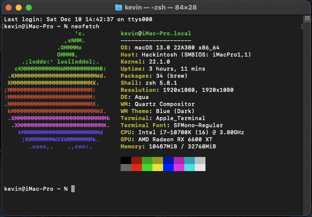
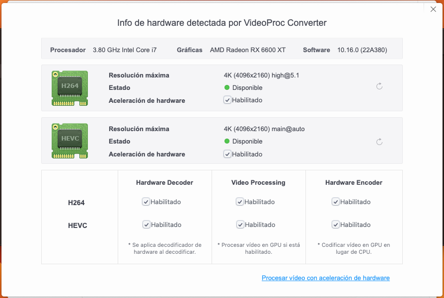
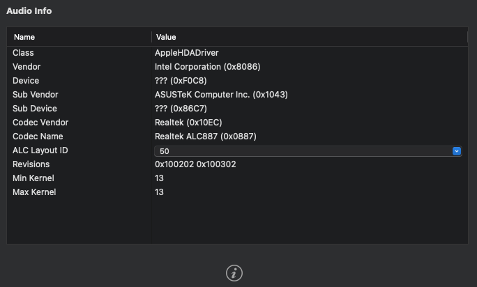

# ASUS-B560M-6600XT-OpenCore-EFI

Asus B560m + i7-10700K + RX 6600XT OpenCore EFI

#### OpenCore 

OpenCore Version: 0.8.7

#### Specs:

| Name | Model | Ventura |
| :---------- | -------------------------------: | :--------: |
| CPU  | Intel® Core™ i7-10700K | ✅ |
| GPU  | MSI AMD Radeon RX 6600 XT 128 bits 8 GB GDDR6 | ✅ |
| RAM  | 2x16GB CORSAIR VENGEANCE DDR4 3600 Mhz | ✅ |
| Motherboard | ASUS PRIME B560M-A | ✅ |
| NVMe | WD Blue SN570 NVMe™ SSD | ✅ |
| Audio Codec | ALC887 | ✅ |
| Ethernet | Intel® Ethernet I219-V | ✅ |

#### Hardware Info

#### Audio Codec Configuration

